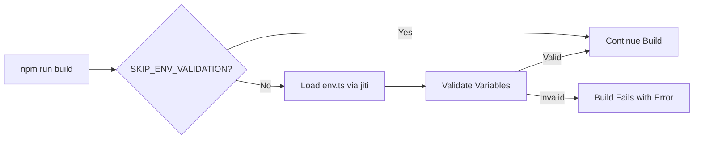

# Teilaufgabe 01.03: Build-Time Validation Setup

## Ziel
Integration der Environment Variable Validation in den Next.js Build-Prozess, sodass fehlende oder fehlerhafte Environment Variables bereits beim Build erkannt werden.

## Zeitschätzung
⏱️ **10 Minuten**

## Voraussetzungen
- [01.01 Dependencies](./01.01-dependencies-installation.md) installiert
- [01.02 Environment Configuration](./01.02-environment-configuration.md) erstellt
- Zugriff auf `next.config.mjs`

## File Location
```
apps/web/next.config.mjs
```

## Implementation

### Schritt 1: Backup Existing Config (Optional)
```bash
# Create backup of existing config
cp apps/web/next.config.mjs apps/web/next.config.mjs.backup
```

### Schritt 2: Update next.config.mjs

```javascript
import { fileURLToPath } from "node:url";
import createJiti from "jiti";

// Setup jiti for TypeScript support
const jiti = createJiti(fileURLToPath(import.meta.url));

// Validate environment variables at build time
// This will throw an error if required variables are missing
if (process.env.SKIP_ENV_VALIDATION !== 'true') {
  await jiti.import("./src/env.ts");
}

/** @type {import('next').NextConfig} */
const nextConfig = {
  // For standalone deployment (Docker, etc.)
  output: process.env.BUILD_STANDALONE === 'true' ? 'standalone' : undefined,
  
  // Required for T3 Env in standalone mode
  transpilePackages: process.env.BUILD_STANDALONE === 'true' 
    ? ["@t3-oss/env-nextjs", "@t3-oss/env-core"] 
    : undefined,
    
  // Existing config options...
  reactStrictMode: true,
  
  // TypeScript and ESLint settings
  typescript: {
    ignoreBuildErrors: false,
  },
  eslint: {
    ignoreDuringBuilds: false,
  },
};

export default nextConfig;
```

### Alternative: Minimal Config
Falls du eine minimal invasive Änderung bevorzugst:

```javascript
import { fileURLToPath } from "node:url";
import createJiti from "jiti";

const jiti = createJiti(fileURLToPath(import.meta.url));

// Only add validation
if (process.env.SKIP_ENV_VALIDATION !== 'true') {
  await jiti.import("./src/env.ts");
}

// Keep rest of existing config unchanged
/** @type {import('next').NextConfig} */
const nextConfig = {
  // Your existing config...
};

export default nextConfig;
```

## How It Works

### Build-Time Flow


### Key Components

1. **jiti**: Transpiles TypeScript on the fly
   - Allows importing `.ts` files in `.mjs` config
   - No pre-compilation needed

2. **Dynamic Import**: `await jiti.import("./src/env.ts")`
   - Executes validation during config loading
   - Fails fast if validation errors occur

3. **Skip Flag**: `SKIP_ENV_VALIDATION`
   - Allows bypassing validation in CI/CD
   - Useful for Docker multi-stage builds

## Environment Control Flags

### SKIP_ENV_VALIDATION
```bash
# Skip validation during build
SKIP_ENV_VALIDATION=true npm run build
```
Use cases:
- CI/CD pipelines where env vars are set later
- Docker build stage without secrets
- Development troubleshooting

### BUILD_STANDALONE
```bash
# Build for standalone deployment
BUILD_STANDALONE=true npm run build
```
Use cases:
- Docker deployments
- Serverless deployments
- Self-contained builds

### DOCKER_BUILD
```bash
# Special handling for Docker builds
DOCKER_BUILD=true npm run build
```
Automatically sets `skipValidation: true` in env.ts

## Testing Build-Time Validation

### Test 1: Valid Environment
```bash
cd apps/web
# Ensure .env exists with all required vars
npm run build
# Expected: Build succeeds
```

### Test 2: Missing Required Variable
```bash
cd apps/web
# Temporarily rename .env
mv .env .env.backup

# Try to build without env vars
npm run build
# Expected: Build fails with clear error message

# Restore .env
mv .env.backup .env
```

### Test 3: Invalid Variable Format
```bash
cd apps/web
# Set invalid DATABASE_URL
DATABASE_URL="not-a-url" npm run build
# Expected: Build fails with validation error
```

### Test 4: Skip Validation Flag
```bash
cd apps/web
# Remove .env temporarily
mv .env .env.backup

# Build with skip flag
SKIP_ENV_VALIDATION=true npm run build
# Expected: Build succeeds (but app won't run properly)

# Restore .env
mv .env.backup .env
```

## CI/CD Configuration Examples

### GitHub Actions
```yaml
# .github/workflows/build.yml
name: Build
on: [push]

jobs:
  build:
    runs-on: ubuntu-latest
    steps:
      - uses: actions/checkout@v3
      - uses: actions/setup-node@v3
        with:
          node-version: '20'
          
      # Option 1: Validate in CI
      - name: Build with validation
        env:
          DATABASE_URL: ${{ secrets.DATABASE_URL }}
          CLERK_SECRET_KEY: ${{ secrets.CLERK_SECRET_KEY }}
          NEXT_PUBLIC_CLERK_PUBLISHABLE_KEY: ${{ secrets.NEXT_PUBLIC_CLERK_PUBLISHABLE_KEY }}
        run: npm run build
        
      # Option 2: Skip validation in CI
      - name: Build without validation
        run: SKIP_ENV_VALIDATION=true npm run build
```

### Vercel
```json
// vercel.json
{
  "buildCommand": "npm run build",
  "env": {
    "SKIP_ENV_VALIDATION": "false"
  }
}
```

### Docker Multi-Stage
```dockerfile
# Build stage - skip validation
FROM node:20-alpine AS builder
WORKDIR /app
COPY . .
ENV SKIP_ENV_VALIDATION=true
ENV BUILD_STANDALONE=true
RUN npm ci && npm run build

# Runtime stage - validate at runtime
FROM node:20-alpine AS runner
WORKDIR /app
COPY --from=builder /app/.next/standalone ./
COPY --from=builder /app/.next/static ./.next/static
ENV VALIDATE_ENV_AT_RUNTIME=true
CMD ["node", "server.js"]
```

## Troubleshooting

### Error: Cannot find module 'jiti'
```bash
# Ensure jiti is installed
npm install jiti --save-dev
```

### Error: Cannot import TypeScript file
```bash
# Check jiti version (needs 2.0+)
npm ls jiti

# Update if needed
npm install jiti@latest
```

### Error: Build hangs during validation
```bash
# Check for circular dependencies
# Ensure env.ts doesn't import from files that import env.ts
```

### Error: Environment validation in production
```javascript
// Add to env.ts for production flexibility
onValidationError: (error) => {
  console.error('⚠️ Environment validation failed:', error);
  // Optionally continue in production
  if (process.env.NODE_ENV === 'production' && 
      process.env.STRICT_ENV !== 'true') {
    return; // Continue despite errors
  }
  throw error; // Fail in development
}
```

## Rollback Plan
```bash
# Restore original config
cp apps/web/next.config.mjs.backup apps/web/next.config.mjs

# Remove backup
rm apps/web/next.config.mjs.backup
```

## Success Criteria
- ✅ next.config.mjs updated with validation
- ✅ Build fails when required env vars missing
- ✅ Build succeeds with valid env vars
- ✅ SKIP_ENV_VALIDATION flag works
- ✅ Clear error messages on validation failure

## Performance Impact
- Build time: +100-200ms für Validation
- Runtime: 0ms (keine Runtime-Kosten)
- Bundle size: 0 bytes (Build-Time only)

## Next Steps
Nach erfolgreicher Build-Time Validation → [01.04 Environment Example Update](./01.04-environment-example-update.md)