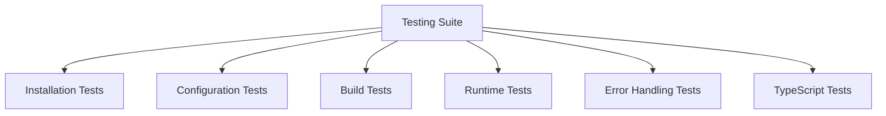

# Teilaufgabe 01.05: Testing & Verification

## Ziel
Umfassende Tests der implementierten Environment Variable Validation um sicherzustellen, dass alle Komponenten korrekt funktionieren und Fehler angemessen behandelt werden.

## Zeitschätzung
⏱️ **15 Minuten**

## Voraussetzungen
- [01.01 Dependencies Installation](./01.01-dependencies-installation.md) ✅
- [01.02 Environment Configuration](./01.02-environment-configuration.md) ✅
- [01.03 Build-Time Validation](./01.03-build-time-validation.md) ✅
- [01.04 Environment Example Update](./01.04-environment-example-update.md) ✅

## Test Suite Overview



## Test 1: Installation Verification

### 1.1 Check Package Installation
```bash
cd apps/web

# Verify packages are installed
npm ls @t3-oss/env-nextjs zod jiti

# Expected output (no errors):
# apps/web@0.1.0
# ├── @t3-oss/env-nextjs@0.11.1
# ├── jiti@2.4.0
# └── zod@3.23.8
```

### 1.2 Check package.json
```bash
# Verify packages in package.json
grep -E "@t3-oss/env-nextjs|zod|jiti" package.json

# Expected: All three packages should be listed
```

**Success Criteria:**
- ✅ All packages installed without errors
- ✅ Correct versions in package.json
- ✅ No peer dependency warnings

## Test 2: Environment Configuration

### 2.1 File Existence
```bash
# Check if env.ts exists
test -f src/env.ts && echo "✅ env.ts exists" || echo "❌ env.ts missing"
```

### 2.2 TypeScript Compilation
```bash
# Test if env.ts compiles without errors
npx tsc --noEmit src/env.ts

# Expected: No output (successful compilation)
```

### 2.3 Import Test
```bash
# Create test file
cat > src/test-import.ts << 'EOF'
import { env } from "./env";
console.log("Environment loaded:", typeof env === "object");
EOF

# Test import
npx tsx src/test-import.ts

# Clean up
rm src/test-import.ts
```

**Success Criteria:**
- ✅ env.ts exists and is valid TypeScript
- ✅ No compilation errors
- ✅ Import works correctly

## Test 3: Build-Time Validation

### 3.1 Missing Required Variables
```bash
# Backup existing .env
mv .env.local .env.local.backup 2>/dev/null || true

# Try to run dev server without env vars
npm run dev 2>&1 | head -20

# Expected: Clear error message about missing DATABASE_URL

# Restore .env
mv .env.local.backup .env.local 2>/dev/null || true
```

### 3.2 Invalid URL Format
```bash
# Create invalid env file
cat > .env.test-invalid << 'EOF'
DATABASE_URL=not-a-valid-url
CLERK_SECRET_KEY=sk_test_valid
NEXT_PUBLIC_CLERK_PUBLISHABLE_KEY=pk_test_valid
EOF

# Test with invalid URL
cp .env.local .env.local.backup 2>/dev/null || true
cp .env.test-invalid .env.local

npm run dev 2>&1 | head -20

# Expected: Validation error for invalid URL format

# Clean up
rm .env.test-invalid
mv .env.local.backup .env.local 2>/dev/null || true
```

### 3.3 Skip Validation Flag
```bash
# Remove env file
mv .env.local .env.local.backup 2>/dev/null || true

# Run with skip flag
SKIP_ENV_VALIDATION=true npm run dev &
DEVPID=$!

# Wait and check if server started
sleep 5
curl -s http://localhost:3004 > /dev/null && echo "✅ Server started with skip flag" || echo "❌ Server failed to start"

# Kill dev server
kill $DEVPID 2>/dev/null

# Restore env
mv .env.local.backup .env.local 2>/dev/null || true
```

**Success Criteria:**
- ✅ Missing variables cause clear errors
- ✅ Invalid formats are caught
- ✅ Skip flag bypasses validation

## Test 4: TypeScript Type Safety

### 4.1 Create Type Test File
```typescript
// Create src/test-types.ts
cat > src/test-types.ts << 'EOF'
import { env } from "./env";

// These should work (no TypeScript errors)
const dbUrl: string = env.DATABASE_URL;
const apiKey: string | undefined = env.OPENAI_API_KEY;
const port: number = env.PORT;
const isAnalytics: boolean | undefined = env.NEXT_PUBLIC_ENABLE_ANALYTICS;

// These should fail (TypeScript errors)
// @ts-expect-error - Wrong type
const wrongType: number = env.DATABASE_URL;

// @ts-expect-error - Property doesn't exist
const notExist = env.NON_EXISTENT_VARIABLE;

// @ts-expect-error - Server var in client context
function ClientComponent() {
  // This would fail at runtime in a client component
  const secret = env.CLERK_SECRET_KEY;
}

console.log("Type tests completed");
EOF
```

### 4.2 Run Type Check
```bash
# Check for type errors
npx tsc --noEmit src/test-types.ts

# Expected: Only the @ts-expect-error lines should have errors

# Clean up
rm src/test-types.ts
```

**Success Criteria:**
- ✅ Correct types for all variables
- ✅ IntelliSense/autocomplete works
- ✅ Type errors for invalid usage

## Test 5: Runtime Behavior

### 5.1 Server Component Test
```typescript
// Create app/test-server/page.tsx
cat > app/test-server/page.tsx << 'EOF'
import { env } from "~/env";

export default function TestServerPage() {
  return (
    <div>
      <h1>Server Environment Test</h1>
      <ul>
        <li>Database: {env.DATABASE_URL ? "✅ Set" : "❌ Missing"}</li>
        <li>Port: {env.PORT}</li>
        <li>Node Env: {env.NODE_ENV}</li>
        <li>OpenAI: {env.OPENAI_API_KEY ? "✅ Set" : "⭕ Not set"}</li>
      </ul>
    </div>
  );
}
EOF

# Test the page
npm run dev &
DEVPID=$!
sleep 5
curl -s http://localhost:3004/test-server | grep "Server Environment Test" && echo "✅ Server component works" || echo "❌ Server component failed"
kill $DEVPID 2>/dev/null

# Clean up
rm -rf app/test-server
```

### 5.2 Client Component Test
```typescript
// Create app/test-client/page.tsx
cat > app/test-client/page.tsx << 'EOF'
'use client';
import { env } from "~/env";

export default function TestClientPage() {
  return (
    <div>
      <h1>Client Environment Test</h1>
      <ul>
        <li>Clerk Key: {env.NEXT_PUBLIC_CLERK_PUBLISHABLE_KEY ? "✅ Set" : "❌ Missing"}</li>
        <li>App URL: {env.NEXT_PUBLIC_APP_URL}</li>
        <li>Analytics: {String(env.NEXT_PUBLIC_ENABLE_ANALYTICS)}</li>
      </ul>
    </div>
  );
}
EOF

# Test the page
npm run dev &
DEVPID=$!
sleep 5
curl -s http://localhost:3004/test-client | grep "Client Environment Test" && echo "✅ Client component works" || echo "❌ Client component failed"
kill $DEVPID 2>/dev/null

# Clean up
rm -rf app/test-client
```

**Success Criteria:**
- ✅ Server components can access server variables
- ✅ Client components can access client variables
- ✅ No runtime errors

## Test 6: Build Process

### 6.1 Production Build
```bash
# Test production build
npm run build

# Expected: Build completes successfully
```

### 6.2 Build Output Check
```bash
# Check if build created output
test -d .next && echo "✅ Build output exists" || echo "❌ Build failed"

# Check for env validation in build log
npm run build 2>&1 | grep -q "validation" && echo "✅ Validation ran during build" || echo "⚠️ Validation may not have run"
```

**Success Criteria:**
- ✅ Build completes without errors
- ✅ Environment validated during build
- ✅ Output directory created

## Test 7: Error Messages Quality

### 7.1 Missing Variable Error
```bash
# Test error message quality
mv .env.local .env.local.backup 2>/dev/null || true

npm run dev 2>&1 | head -30 > /tmp/error-output.txt

# Check for helpful error message
grep -q "DATABASE_URL" /tmp/error-output.txt && echo "✅ Error mentions DATABASE_URL" || echo "❌ Unclear error message"
grep -q "Required" /tmp/error-output.txt && echo "✅ Error mentions 'Required'" || echo "❌ No required indication"

# Restore
mv .env.local.backup .env.local 2>/dev/null || true
rm /tmp/error-output.txt
```

**Success Criteria:**
- ✅ Error clearly states which variable is missing
- ✅ Error indicates if variable is required
- ✅ Error provides helpful context

## Test 8: Docker/CI Compatibility

### 8.1 Docker Build Simulation
```bash
# Simulate Docker build without env vars
DOCKER_BUILD=true SKIP_ENV_VALIDATION=true npm run build

# Expected: Build succeeds without validation
```

### 8.2 Standalone Build
```bash
# Test standalone build flag
BUILD_STANDALONE=true npm run build

# Check output mode
grep -q "standalone" .next/required-server-files.json 2>/dev/null && echo "✅ Standalone build created" || echo "⚠️ Standard build created"
```

**Success Criteria:**
- ✅ Docker flags work correctly
- ✅ CI/CD compatible with skip flags
- ✅ Standalone builds possible

## Automated Test Script

Create `apps/web/test-env-validation.sh`:

```bash
#!/bin/bash

echo "🧪 Starting Environment Validation Tests..."
echo "========================================="

TESTS_PASSED=0
TESTS_FAILED=0

# Function to run a test
run_test() {
  local test_name=$1
  local test_command=$2
  
  echo -n "Testing: $test_name... "
  
  if eval "$test_command" > /dev/null 2>&1; then
    echo "✅ PASSED"
    ((TESTS_PASSED++))
  else
    echo "❌ FAILED"
    ((TESTS_FAILED++))
  fi
}

# Run tests
run_test "Package Installation" "npm ls @t3-oss/env-nextjs"
run_test "env.ts exists" "test -f src/env.ts"
run_test "TypeScript Compilation" "npx tsc --noEmit src/env.ts"
run_test ".env.example exists" "test -f .env.example"
run_test "Build with env vars" "test -f .env.local && npm run build"

# Summary
echo "========================================="
echo "Results: $TESTS_PASSED passed, $TESTS_FAILED failed"

if [ $TESTS_FAILED -eq 0 ]; then
  echo "🎉 All tests passed!"
  exit 0
else
  echo "❌ Some tests failed"
  exit 1
fi
```

Make it executable:
```bash
chmod +x test-env-validation.sh
./test-env-validation.sh
```

## Debugging Common Issues

### Issue: Import Errors
```bash
# Check tsconfig paths
grep -A5 '"paths"' tsconfig.json

# Ensure ~/env path is configured
# Should show: "~/*": ["./src/*"]
```

### Issue: Build Hangs
```bash
# Check for circular dependencies
npx madge --circular src/

# Look for env.ts in any cycles
```

### Issue: Client/Server Mismatch
```typescript
// Debug helper
console.log("Is Server:", typeof window === "undefined");
console.log("Available vars:", Object.keys(env));
```

## Final Verification Checklist

- [ ] ✅ All dependencies installed correctly
- [ ] ✅ env.ts created and compiles
- [ ] ✅ next.config.mjs updated with validation
- [ ] ✅ .env.example comprehensive and documented
- [ ] ✅ Missing variables cause clear errors
- [ ] ✅ Invalid formats are caught
- [ ] ✅ TypeScript types work correctly
- [ ] ✅ Client/Server separation works
- [ ] ✅ Build process succeeds
- [ ] ✅ Skip flags work for CI/CD
- [ ] ✅ Error messages are helpful
- [ ] ✅ Docker/Standalone builds work

## Success Metrics

| Metric | Target | Actual |
|--------|--------|--------|
| Build Time Impact | < 200ms | ___ ms |
| Type Safety | 100% | ___% |
| Error Clarity | Clear messages | ✅/❌ |
| CI/CD Compatible | Yes | ✅/❌ |
| Docker Ready | Yes | ✅/❌ |

## Summary

Nach Abschluss aller Tests solltest du haben:
1. **Robuste Validation** bei jedem App-Start
2. **Type Safety** für alle Environment Variables
3. **Klare Fehlermeldungen** bei Problemen
4. **CI/CD Kompatibilität** mit Skip-Flags
5. **Dokumentierte Examples** für neue Entwickler

## Rollback Instructions

Falls kritische Probleme auftreten:

```bash
# 1. Remove env.ts
rm apps/web/src/env.ts

# 2. Restore original next.config.mjs
git checkout apps/web/next.config.mjs

# 3. Uninstall packages
npm uninstall @t3-oss/env-nextjs zod jiti

# 4. Clear cache and rebuild
rm -rf .next
npm run build
```

## Next Steps

✅ Alle Tests erfolgreich? 
→ Environment Validation ist production-ready!

Weitere Optimierungen:
- GitHub Action für automatische Tests
- Pre-commit Hook für env.example Updates
- Dashboard für Environment Status
- Secrets Rotation Automation