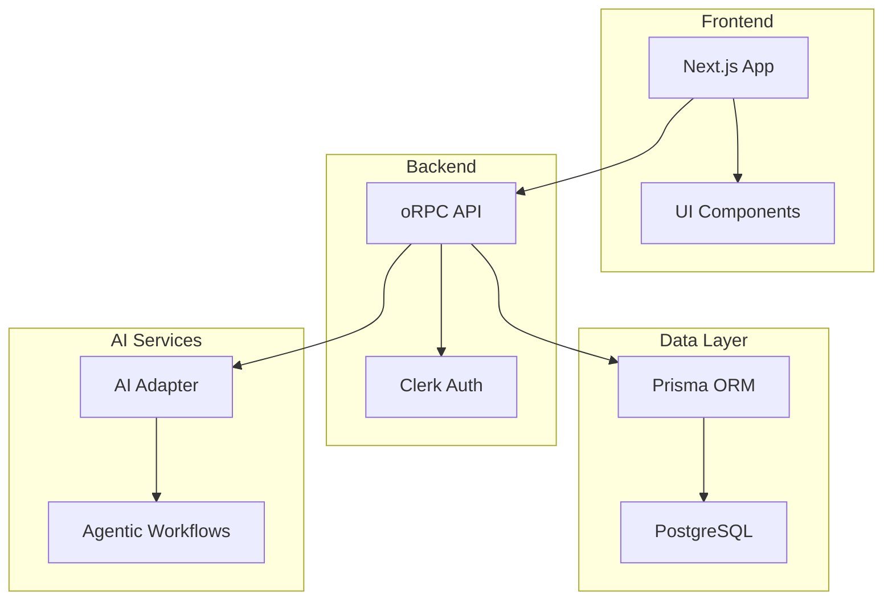

# Arbeitspaket 16: Dokumentation

## Ziel
Erstellung einer vollständigen technischen Dokumentation für API, Komponenten und Benutzerhandbuch.

## Problem
- Keine API-Dokumentation vorhanden
- Fehlende Komponenten-Dokumentation
- Kein Benutzerhandbuch
- Keine Architektur-Dokumentation

## Kontext
- Storybook für UI-Komponenten
- TypeDoc für API-Dokumentation
- Markdown für Handbücher und API-Referenz
- oRPC mit TypeScript für type-safe APIs (ohne OpenAPI-Support)

## Implementierung

### 1. Storybook Setup für UI-Komponenten

```bash
cd packages/ui
npm create storybook@latest
# Folge den Prompts und wähle React + Vite
npm install --save-dev @storybook/addon-essentials @storybook/addon-docs @storybook/addon-a11y
```

**packages/ui/.storybook/main.ts:**
```typescript
import type { StorybookConfig } from '@storybook/react-vite';

const config: StorybookConfig = {
  stories: ['../src/**/*.stories.@(js|jsx|ts|tsx|mdx)'],
  addons: [
    '@storybook/addon-essentials',
    '@storybook/addon-docs',
    '@storybook/addon-a11y',
  ],
  framework: {
    name: '@storybook/react-vite',
    options: {},
  },
  docs: {
    autodocs: 'tag',
  },
};

export default config;
```

**packages/ui/src/components/Button/Button.stories.tsx:**
```typescript
import type { Meta, StoryObj } from '@storybook/react';
import { Button } from './Button';

const meta: Meta<typeof Button> = {
  title: 'Components/Button',
  component: Button,
  parameters: {
    layout: 'centered',
  },
  tags: ['autodocs'],
  argTypes: {
    variant: {
      control: 'select',
      options: ['default', 'destructive', 'outline', 'secondary', 'ghost', 'link'],
    },
    size: {
      control: 'select',
      options: ['sm', 'md', 'lg', 'icon'],
    },
  },
};

export default meta;
type Story = StoryObj<typeof meta>;

export const Default: Story = {
  args: {
    children: 'Button',
  },
};

export const Variants: Story = {
  render: () => (
    <div className="flex gap-4 flex-wrap">
      <Button variant="default">Default</Button>
      <Button variant="destructive">Destructive</Button>
      <Button variant="outline">Outline</Button>
      <Button variant="secondary">Secondary</Button>
      <Button variant="ghost">Ghost</Button>
      <Button variant="link">Link</Button>
    </div>
  ),
};

export const Sizes: Story = {
  render: () => (
    <div className="flex gap-4 items-center">
      <Button size="sm">Small</Button>
      <Button size="md">Medium</Button>
      <Button size="lg">Large</Button>
      <Button size="icon">🚀</Button>
    </div>
  ),
};

export const Loading: Story = {
  args: {
    children: 'Loading...',
    disabled: true,
  },
};
```

### 2. TypeDoc für API-Dokumentation

```bash
npm install --save-dev typedoc @typedoc2md/typedoc-plugin-markdown
```

**typedoc.json:**
```json
{
  "entryPoints": [
    "packages/api/src",
    "packages/ai-adapter/src",
    "packages/agentic-workflows/src"
  ],
  "out": "docs/api",
  "plugin": ["@typedoc2md/typedoc-plugin-markdown"],
  "theme": "markdown",
  "excludePrivate": true,
  "excludeInternal": true,
  "categorizeByGroup": true,
  "navigation": true,
  "readme": "README.md"
```

**packages/api/src/procedures/user.ts mit JSDoc:**
```typescript
/**
 * User API procedures
 * @module UserProcedures
 */

import { oContract } from '@orpc/contract';
import { z } from 'zod';

/**
 * User data schema
 * @category Schemas
 */
export const UserSchema = z.object({
  id: z.string().uuid(),
  email: z.string().email(),
  name: z.string().optional(),
  createdAt: z.date(),
  updatedAt: z.date(),
});

/**
 * User procedures contract
 * @category Contracts
 */
export const userContract = oContract({
  /**
   * Get current user profile
   * @returns {Promise<User>} Current user data
   * @throws {UnauthorizedError} If user is not authenticated
   * @example
   * ```typescript
   * const user = await api.user.getProfile();
   * console.log(user.email);
   * ```
   */
  getProfile: oContract()
    .output(UserSchema),

  /**
   * Update user profile
   * @param {Object} data - Update data
   * @param {string} [data.name] - New name
   * @param {string} [data.email] - New email
   * @returns {Promise<User>} Updated user data
   * @example
   * ```typescript
   * const updated = await api.user.updateProfile({
   *   name: 'John Doe'
   * });
   * ```
   */
  updateProfile: oContract()
    .input(z.object({
      name: z.string().optional(),
      email: z.string().email().optional(),
    }))
    .output(UserSchema),

  /**
   * Delete user account
   * @param {string} confirmation - Confirmation phrase "DELETE MY ACCOUNT"
   * @returns {Promise<void>}
   * @throws {ValidationError} If confirmation is incorrect
   * @example
   * ```typescript
   * await api.user.deleteAccount('DELETE MY ACCOUNT');
   * ```
   */
  deleteAccount: oContract()
    .input(z.object({
      confirmation: z.literal('DELETE MY ACCOUNT'),
    }))
    .output(z.void()),
});
```

### 3. API Route Dokumentation

Da oRPC keine automatische OpenAPI-Generierung unterstützt, dokumentieren wir die API-Routes über:
1. **TypeDoc mit JSDoc-Kommentaren** (siehe oben)
2. **Markdown-basierte API-Referenz** für externe Entwickler
3. **Type-Safe Client Examples** in der Dokumentation

**docs/API_REFERENCE.md:**
```markdown
# API Reference

## Authentication

All API endpoints require authentication via Clerk JWT token in the Authorization header:
```
Authorization: Bearer <token>
```

## Endpoints

### User Procedures

#### `api.user.getProfile()`
Get the current authenticated user's profile.

**Returns:** `User`
```typescript
{
  id: string;
  email: string;
  name?: string;
  createdAt: Date;
  updatedAt: Date;
}
```

#### `api.user.updateProfile(data)`
Update the current user's profile.

**Parameters:**
- `data.name?`: string - New display name
- `data.email?`: string - New email address

**Returns:** `User` - Updated user object

#### `api.user.deleteAccount(confirmation)`
Delete the current user's account.

**Parameters:**
- `confirmation`: "DELETE MY ACCOUNT" - Safety confirmation

**Returns:** `void`

### Post Procedures

#### `api.posts.list(params)`
List posts with pagination.

**Parameters:**
- `params.page`: number - Page number (default: 1)
- `params.limit`: number - Items per page (default: 10)

**Returns:** `PaginatedResponse<Post>`

## Error Codes

| Code | Description |
|------|-------------|
| 401 | Unauthorized - Invalid or missing token |
| 403 | Forbidden - Insufficient permissions |
| 404 | Not Found - Resource doesn't exist |
| 422 | Validation Error - Invalid input data |
| 500 | Internal Server Error |
```

### 4. Architektur-Dokumentation

**docs/ARCHITECTURE.md:**
```markdown
# Architektur-Dokumentation

## Überblick

App Starter Kit ist eine modulare Monolith-Architektur basierend auf:
- **Turborepo**: Monorepo-Management
- **Next.js 15**: Frontend-Framework
- **TypeScript**: Type-Safety
- **PostgreSQL/Prisma**: Datenpersistenz

## Architektur-Diagramm



## Package-Struktur

### Apps
- **apps/web**: Hauptanwendung mit Next.js 15

### Packages
- **@starter-kit/ui**: Wiederverwendbare UI-Komponenten
- **@starter-kit/db**: Datenbankschema und Prisma Client
- **@starter-kit/auth**: Authentifizierung mit Clerk
- **@starter-kit/api**: API-Layer mit oRPC
- **@starter-kit/ai-adapter**: AI-Provider-Abstraktion
- **@starter-kit/agentic-workflows**: Workflow-Engine

## Datenfluss

1. **Request**: Client sendet Request an Next.js
2. **Auth**: Clerk validiert Authentifizierung
3. **API**: oRPC verarbeitet Request mit Validation
4. **Data**: Prisma führt Datenbankoperationen aus
5. **AI**: Optional: AI-Services werden aufgerufen
6. **Response**: Typsichere Response an Client

## Sicherheit

- **Authentifizierung**: Clerk mit JWT
- **Autorisierung**: RBAC mit Middleware
- **Validation**: Zod-Schemas für alle Inputs
- **Rate Limiting**: Via Upstash
- **CORS**: Konfiguriert für Production

## Performance

- **Caching**: Redis/Upstash für API-Responses
- **CDN**: Statische Assets via Vercel
- **Database**: Connection Pooling mit Prisma
- **Code Splitting**: Automatisch via Next.js

## Deployment

- **Hosting**: Vercel (Frontend + API)
- **Database**: Neon (PostgreSQL)
- **Auth**: Clerk Cloud
- **Monitoring**: Sentry
- **Analytics**: Vercel Analytics
```

### 5. Benutzerhandbuch

**docs/USER_GUIDE.md:**
```markdown
# Benutzerhandbuch

## Installation

### Voraussetzungen
- Node.js 18+
- npm 9+
- PostgreSQL Datenbank

### Setup

1. Repository klonen:
\`\`\`bash
git clone https://github.com/yourusername/app-starter-kit.git
cd app-starter-kit
\`\`\`

2. Dependencies installieren:
\`\`\`bash
npm install
\`\`\`

3. Environment-Variablen konfigurieren:
\`\`\`bash
cp .env.example .env
# .env bearbeiten mit eigenen Werten
\`\`\`

4. Datenbank migrieren:
\`\`\`bash
npm run db:migrate
npm run db:seed
\`\`\`

5. Development Server starten:
\`\`\`bash
npm run dev
\`\`\`

## Features

### Authentifizierung
- Registrierung mit E-Mail
- Social Login (Google, GitHub)
- Zwei-Faktor-Authentifizierung

### API-Nutzung

#### Authentifizierung
\`\`\`typescript
import { api } from '@/lib/api';

// Login
const session = await api.auth.login({
  email: 'user@example.com',
  password: 'password'
});

// Logout
await api.auth.logout();
\`\`\`

#### User-Operationen
\`\`\`typescript
// Profil abrufen
const profile = await api.user.getProfile();

// Profil aktualisieren
await api.user.updateProfile({
  name: 'Neuer Name'
});
\`\`\`

#### Posts verwalten
\`\`\`typescript
// Posts abrufen
const posts = await api.posts.list({
  page: 1,
  limit: 10
});

// Post erstellen
const newPost = await api.posts.create({
  title: 'Mein Post',
  content: 'Inhalt...'
});
\`\`\`

## Troubleshooting

### Häufige Probleme

**Datenbankverbindung fehlgeschlagen**
- DATABASE_URL überprüfen
- PostgreSQL läuft?
- Firewall-Einstellungen prüfen

**Build-Fehler**
- Node-Version überprüfen (18+)
- Cache löschen: \`rm -rf .next node_modules\`
- Neu installieren: \`npm install\`

**TypeScript-Fehler**
- \`npm run type-check\` ausführen
- Prisma Client generieren: \`npm run db:generate\`

## Support

- GitHub Issues: [Link zu Issues]
- Discord: [Link zu Discord]
- E-Mail: support@example.com
```

### 6. Package.json Scripts für Dokumentation

**package.json:**
```json
{
  "scripts": {
    "docs:api": "typedoc",
    "docs:storybook": "cd packages/ui && storybook build",
    "docs:storybook:dev": "cd packages/ui && storybook dev -p 6006",
    "docs:serve": "npx serve docs",
    "docs:build": "npm run docs:api && npm run docs:storybook && mv packages/ui/storybook-static docs/storybook",
    "docs:clean": "rm -rf docs/api docs/storybook"
  }
}
```

### 7. README.md Update

**README.md:**
```markdown
# App Starter Kit

Modern, production-ready starter kit for AI-powered applications.

## 📚 Documentation

- [Architecture](./docs/ARCHITECTURE.md)
- [User Guide](./docs/USER_GUIDE.md)
- [API Documentation](./docs/api/README.md)
- [Component Storybook](https://storybook.example.com)

## 🚀 Quick Start

\`\`\`bash
# Clone repository
git clone https://github.com/yourusername/app-starter-kit.git

# Install dependencies
npm install

# Setup environment
npm run setup

# Start development
npm run dev
\`\`\`

## 📦 What's Included

- ✅ **Next.js 15** - Latest React framework
- ✅ **TypeScript** - Type-safe development
- ✅ **Tailwind CSS** - Utility-first CSS
- ✅ **Clerk** - Authentication & user management
- ✅ **Prisma** - Type-safe database ORM
- ✅ **oRPC** - End-to-end type-safe APIs
- ✅ **AI Integration** - Multi-provider AI adapter
- ✅ **Testing** - Vitest & Playwright
- ✅ **Documentation** - Storybook & TypeDoc

## 📖 Documentation

### Development
- \`npm run dev\` - Start development server
- \`npm run build\` - Build for production
- \`npm run test\` - Run tests
- \`npm run lint\` - Lint code

### Documentation
- \`npm run docs:storybook:dev\` - Start Storybook development server
- \`npm run docs:build\` - Build all documentation
- \`npm run docs:serve\` - Serve built documentation
- \`npm run docs:clean\` - Clean documentation build files

## 🤝 Contributing

See [CONTRIBUTING.md](./CONTRIBUTING.md) for contribution guidelines.

## 📄 License

MIT License - see [LICENSE](./LICENSE) for details.
```

## Verifikation

```bash
# Storybook testen
npm run docs:storybook:dev
# Browser: http://localhost:6006

# API-Dokumentation generieren
npm run docs:api
ls docs/api/

# Alle Docs bauen
npm run docs:build

# Dokumentation servieren
npm run docs:serve
# Browser: http://localhost:3000
```

## Erfolgskriterien

- [ ] Storybook läuft mit allen Komponenten
- [ ] TypeDoc generiert API-Dokumentation mit Markdown-Output
- [ ] API-Referenz in Markdown dokumentiert
- [ ] Architektur-Dokumentation vollständig
- [ ] Benutzerhandbuch verständlich
- [ ] README aktualisiert
- [ ] Alle Dokumentations-Scripts funktionieren

## Potenzielle Probleme & Lösungen

1. **Storybook-Konflikte**: Vite-Config anpassen für Monorepo-Struktur
2. **TypeDoc-Fehler**: TSConfig paths konfigurieren, eventuell separate tsconfig.doc.json
3. **Große Docs**: Separate Hosting-Lösung oder CDN für statische Assets
4. **oRPC Type-Exports**: Sicherstellen dass alle Types exportiert werden für TypeDoc

## Zeitschätzung
- 2-3 Stunden