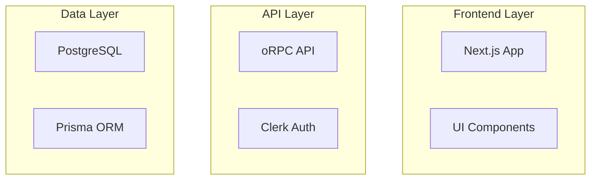

# Sub-Task 16.04: Architektur-Dokumentation

## Ziel
Erstellung einer umfassenden Architektur-Dokumentation, die das System-Design, Datenflüsse und technische Entscheidungen erklärt.

## Umfang
- System-Übersicht und Architektur-Diagramme
- Package-Struktur und Abhängigkeiten
- Datenfluss-Dokumentation
- Sicherheitskonzept
- Performance-Überlegungen
- Deployment-Strategie

## Implementierungsschritte

### 1. ARCHITECTURE.md erstellen
Hauptdokument mit folgenden Sektionen:
- **System Overview**
- **Architecture Principles** (Modular Monolith)
- **Technology Stack**
- **Package Architecture**

### 2. Mermaid-Diagramme


### 3. Package-Dokumentation
Für jedes Package:
- **Zweck und Verantwortlichkeit**
- **Public API/Exports**
- **Dependencies**
- **Key Design Decisions**

### 4. Datenfluss-Dokumentation
- Request Lifecycle
- Authentication Flow
- Data Validation Pipeline
- Error Propagation

### 5. Infrastruktur-Dokumentation
```markdown
## Deployment Architecture
- Frontend: Vercel
- Database: Neon PostgreSQL
- Auth: Clerk Cloud
- File Storage: S3/Cloudinary
- Monitoring: Sentry
```

### 6. Security Architecture
- Authentication & Authorization
- Data Encryption
- API Security (Rate Limiting, CORS)
- Environment Variables Management

### 7. Performance Considerations
- Caching Strategy (Redis/Upstash)
- Database Query Optimization
- Code Splitting
- Edge Functions

## Erfolgskriterien
- [ ] Vollständige System-Übersicht
- [ ] Alle Diagramme renderbar (Mermaid)
- [ ] Package-Beziehungen klar dokumentiert
- [ ] Security-Konzept vollständig
- [ ] Deployment-Guide enthalten

## Geschätzter Aufwand
45-60 Minuten

## Abhängigkeiten
- Keine direkten Abhängigkeiten

## Diagramm-Typen
1. **System Architecture** (High-Level)
2. **Data Flow** (Request/Response)
3. **Package Dependencies** (Graph)
4. **Deployment Topology** 
5. **Security Boundaries**

## Best Practices
- Diagramme mit Mermaid (GitHub-kompatibel)
- ADRs (Architecture Decision Records) für wichtige Entscheidungen
- Versionierung der Architektur-Docs
- Links zu relevanten Code-Stellen

## Notizen
- Living Document - regelmäßig aktualisieren
- C4 Model könnte für größere Projekte verwendet werden
- Kann als Onboarding-Dokument dienen