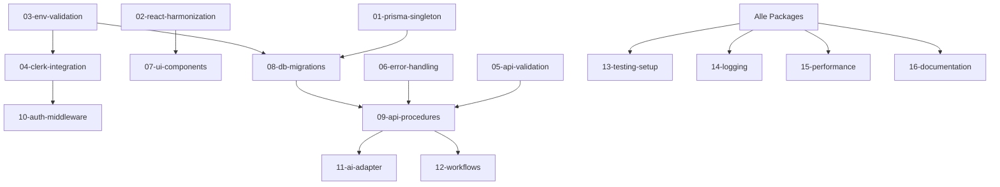

# Master Tasklist - App Starter Kit Production Implementation

## Phase 1: Kritische Security & Stability Fixes
- [ ] **01-prisma-singleton.md** - PrismaClient Singleton Pattern implementieren
- [ ] **02-react-harmonization.md** - React Versionen zwischen Packages harmonisieren  
- [ ] **03-env-validation.md** - Environment Variable Validation mit Zod

## Phase 2: Core Authentication & API
- [ ] **04-clerk-integration.md** - Vollständige Clerk Authentication Integration
- [ ] **05-api-validation.md** - API Input Validation mit Zod implementieren
- [ ] **06-error-handling.md** - Global Error Handling Strategy

## Phase 3: Package Implementations
- [ ] **07-ui-components.md** - UI Component Library vervollständigen
- [ ] **08-db-migrations.md** - Datenbank Schema Design & Migrations
- [ ] **09-api-procedures.md** - API Procedures & Business Logic
- [ ] **10-auth-middleware.md** - Authentication Middleware & Protected Routes
- [ ] **11-ai-adapter.md** - AI Adapter für OpenAI/Anthropic/Google
- [ ] **12-workflows.md** - Agentic Workflows Framework

## Phase 4: Quality & Production Readiness
- [ ] **13-testing-setup.md** - Testing Strategy & erste Unit/Integration Tests
- [ ] **14-logging.md** - Logging & Monitoring mit winston/pino
- [ ] **15-performance.md** - Performance Optimierungen & Caching
- [ ] **16-documentation.md** - Finale API & User Dokumentation

## Fortschritt
- **Total**: 0/16 Arbeitspakete
- **Phase 1**: 0/3 (Kritisch)
- **Phase 2**: 0/3 (Core Features)
- **Phase 3**: 0/6 (Packages)
- **Phase 4**: 0/4 (Quality)

## Geschätzter Zeitaufwand
- **Phase 1**: 2-3 Stunden
- **Phase 2**: 4-5 Stunden
- **Phase 3**: 8-10 Stunden
- **Phase 4**: 4-6 Stunden
- **Gesamt**: ~20-24 Stunden

## Abhängigkeiten
