# Master Tasklist - App Starter Kit Production Implementation

## Phase 1: Foundation & Security ⚡ KRITISCH
### ✅ Task 1: Environment Validation (01-env-validation.md) 
- [ ] 01.01 Dependencies Installation
- [ ] 01.02 Environment Configuration  
- [ ] 01.03 Build-time Validation
- [ ] 01.04 Environment Example Update
- [ ] 01.05 Testing & Verification
*Status: Grundlegende Implementierung abgeschlossen, Subtasks noch zu bearbeiten*

### ✅ Task 2: UI Package Setup (02-prisma-singleton.md → aktuell nur Button Component)
- [ ] 02.01 Vorbereitung
- [ ] 02.02 Singleton Implementation  
- [ ] 02.03 Singleton Test
- [ ] 02.04 Connection Test
- [ ] 02.05 Hot Reload Test
- [ ] 02.06 Finale Verifizierung
*Status: Button Component implementiert, PrismaClient Singleton steht noch aus*

### Task 3: Database Migrations (03-db-migrations.md)
- [ ] 03.01 Prisma Schema
- [ ] 03.02 Database Client
- [ ] 03.03 Seed Data
- [ ] 03.04 Database Utilities
- [ ] 03.05 Export Configuration
- [ ] 03.06 Package Configuration
- [ ] 03.07 Migration Testing

## Phase 2: Authentication & API Core 🔐
### Task 4: Clerk Integration (04-clerk-integration.md)
- [ ] 04.01 Clerk Provider Setup
- [ ] 04.02 Middleware Implementation
- [ ] 04.03 Auth Package
- [ ] 04.04 Auth Components
- [ ] 04.05 Auth Pages
- [ ] 04.06 Protected Dashboard
- [ ] 04.07 Unauthorized Page
- [ ] 04.08 Homepage Update
- [ ] 04.09 Environment Variables
- [ ] 04.10 Testing & Verification

### Task 5: Auth Middleware (05-auth-middleware.md)
- [ ] 05.01 Clerk Dashboard Config
- [ ] 05.02 TypeScript Definitions
- [ ] 05.03 Middleware Implementation
- [ ] 05.04 Auth Package Enhancement
- [ ] 05.05 Protected Page Wrapper
- [ ] 05.06 API Route Protection
- [ ] 05.07 Unauthorized Page
- [ ] 05.08 Usage Examples
- [ ] 05.09 Admin Role Management
- [ ] 05.10 Verification Tests

### Task 6: API Validation (06-api-validation.md)
- [ ] 06.01 Base Schemas
- [ ] 06.02 User Schemas
- [ ] 06.03 Router Validation
- [ ] 06.04 Error Handler
- [ ] 06.05 Client Usage
- [ ] 06.06 REST Bridge
- [ ] 06.07 Testing

### Task 7: API Procedures (07-api-procedures.md)
- [ ] 07.01 Context & Error Handling
- [ ] 07.02 Base Procedures & Middleware
- [ ] 07.03 User Procedures
- [ ] 07.04 Post Procedures
- [ ] 07.05 Router Assembly
- [ ] 07.06 Client SDK
- [ ] 07.07 API Route Handler
- [ ] 07.08 Testing & Verification

### Task 8: Error Handling (08-error-handling.md)
- [ ] 08.01 oRPC Error Setup
- [ ] 08.02 Prisma Error Handler
- [ ] 08.03 oRPC Router Update
- [ ] 08.04 Global Error Boundary
- [ ] 08.05 Component Error Boundary
- [ ] 08.06 Toast Setup
- [ ] 08.07 Error Toast Hook
- [ ] 08.08 API Client Setup
- [ ] 08.09 Error Page
- [ ] 08.10 Testing & Verification

## Phase 3: Package Implementations 📦
### Task 9: Testing Setup (09-testing-setup.md)
- [ ] 09.01 Dependencies Installation
- [ ] 09.02 Testing Configuration
- [ ] 09.03 Setup Files
- [ ] 09.04 Test Utilities
- [ ] 09.05 Test Factories
- [ ] 09.06 UI Component Tests
- [ ] 09.07 API Integration Tests
- [ ] 09.08 E2E Setup
- [ ] 09.09 E2E Tests
- [ ] 09.10 Test Scripts
- [ ] 09.11 Verifizierung
- [ ] 09.12 CI/CD Pipeline einrichten
- [ ] 09.13 Pre-Commit Hooks einrichten
- [ ] 09.14 E2E-Test-Seeding

### Task 10: React Harmonization (10-react-harmonization.md)
- [ ] 10.01 UI Package Update
- [ ] 10.02 Check Other Packages
- [ ] 10.03 Root Dependencies
- [ ] 10.04 TypeScript Config
- [ ] 10.05 Reinstall Dependencies
- [ ] 10.06 Build Test
- [ ] 10.07 Type Check
- [ ] 10.08 Version Verification

### Task 11: UI Components (11-ui-components.md)
- [ ] 11.01 Provider Abstraction
- [ ] 11.02 OpenAI Integration
- [ ] 11.03 Anthropic Integration
- [ ] 11.04 Google Gemini Integration
- [ ] 11.05 Streaming Support
- [ ] 11.06 Error Handling & Retry
- [ ] 11.07 Token Management
- [ ] 11.08 Testing & Mocking

### Task 12: AI Adapter (12-ai-adapter.md)
- [ ] 12.01 Dependencies Installation
- [ ] 12.02 Base Types & Interfaces
- [ ] 12.03 Base Provider Class
- [ ] 12.04 OpenAI Provider
- [ ] 12.05 Anthropic Provider
- [ ] 12.06 Google Provider
- [ ] 12.07 Main Adapter
- [ ] 12.08 Usage Examples
- [ ] 12.09 Testing & Verification
- [ ] 12.10 Error Handling Patterns
- [ ] 12.11 Performance Optimization
- [ ] 12.12 Integration & Rollback

### Task 13: Agentic Workflows (13-workflows.md)
- [ ] 13.01 Dependencies & Types
- [ ] 13.02 Base Workflow
- [ ] 13.03 LLM Bridge
- [ ] 13.04 Content Workflow
- [ ] 13.05 Tool Workflow
- [ ] 13.06 Blog Workflow
- [ ] 13.07 Main Exports
- [ ] 13.08 Testing

## Phase 4: Production Readiness 🚀
### Task 14: Logging & Monitoring (14-logging.md)
- [ ] 14.01 Pino Logger Setup
- [ ] 14.02 Sentry Next.js 15 Integration
- [ ] 14.03 Prometheus Metrics
- [ ] 14.04 Health Checks
- [ ] 14.05 Prisma Logging Integration
- [ ] 14.06 OpenTelemetry (Optional)
- [ ] 14.07 Log Management Strategy
- [ ] 14.08 Testing & Verification

### Task 15: Performance Optimization (15-performance.md)
- [ ] 15.01 Redis Caching
- [ ] 15.02 React Query
- [ ] 15.03 Database Optimization
- [ ] 15.04 Next.js Performance
- [ ] 15.05 Component Optimization
- [ ] 15.06 API Caching
- [ ] 15.07 Edge Caching
- [ ] 15.08 Bundle Optimization
- [ ] 15.09 Monitoring
- [ ] 15.10 Testing & Verification

### Task 16: Documentation (16-documentation.md)
- [ ] 16.01 Storybook Setup
- [ ] 16.02 TypeDoc API Documentation
- [ ] 16.03 API Reference Documentation
- [ ] 16.04 Architecture Documentation
- [ ] 16.05 User Guide
- [ ] 16.06 Documentation Scripts

## Fortschritt Übersicht

### Phase 1: Foundation & Security ⚡
- **Task 1**: 🔄 **TEILWEISE** (Basis ✅, Subtasks 0/5)
- **Task 2**: 🔄 **TEILWEISE** (Button ✅, PrismaClient Subtasks 0/6) 
- **Task 3**: ⏳ **BEREIT** (0/7 Subtasks)

### Phase 2: Authentication & API Core 🔐
- **Task 4**: ⏳ **BEREIT** (0/10 Subtasks)
- **Task 5**: ⏳ **BEREIT** (0/10 Subtasks)
- **Task 6**: ⏳ **BEREIT** (0/7 Subtasks)
- **Task 7**: ⏳ **BEREIT** (0/8 Subtasks)
- **Task 8**: ⏳ **BEREIT** (0/10 Subtasks)

### Phase 3: Package Implementations 📦
- **Task 9**: ⏳ **BEREIT** (0/14 Subtasks)
- **Task 10**: ⏳ **BEREIT** (0/8 Subtasks)
- **Task 11**: ⏳ **BEREIT** (0/8 Subtasks)
- **Task 12**: ⏳ **BEREIT** (0/12 Subtasks)
- **Task 13**: ⏳ **BEREIT** (0/8 Subtasks)

### Phase 4: Production Readiness 🚀
- **Task 14**: ⏳ **BEREIT** (0/8 Subtasks)
- **Task 15**: ⏳ **BEREIT** (0/10 Subtasks)
- **Task 16**: ⏳ **BEREIT** (0/6 Subtasks)

## Statistiken
- **Gesamt**: 0/16 Tasks **Vollständig Abgeschlossen** | 2/16 Tasks **Teilweise** | **151 Subtasks** verbleibend
- **Aktueller Fokus**: Task 2 - PrismaClient Singleton (fehlt noch)
- **Nächste Priorität**: Phase 1 - Foundation abschließen vor Phase 2

## Abhängigkeiten & Reihenfolge

```mermaid
graph TD
    T1[Task 1: Env Validation ✅] --> T3[Task 3: DB Migrations]
    T2[Task 2: Prisma Singleton ✅] --> T3
    T3 --> T4[Task 4: Clerk Integration]
    T3 --> T6[Task 6: API Validation]
    T4 --> T5[Task 5: Auth Middleware]
    T6 --> T7[Task 7: API Procedures]
    T8[Task 8: Error Handling] --> T7
    T7 --> T12[Task 12: AI Adapter]
    T7 --> T13[Task 13: Workflows]
    T10[Task 10: React Harmonization] --> T11[Task 11: UI Components]
    
    %% Phase 4 depends on all previous phases
    subgraph "Production Ready"
        T14[Task 14: Logging]
        T15[Task 15: Performance]
        T16[Task 16: Documentation]
    end
    
    T7 --> T14
    T11 --> T14
    T12 --> T14
    T13 --> T14
```

## Geschätzte Zeiten
- **Phase 1**: ~6 Stunden (2 Tasks ✅ abgeschlossen + Task 3)
- **Phase 2**: ~15 Stunden (5 Tasks)
- **Phase 3**: ~18 Stunden (5 Tasks)
- **Phase 4**: ~12 Stunden (3 Tasks)
- **Gesamt**: ~51 Stunden für vollständige Implementierung

---
*Letzte Aktualisierung: 09.01.2025*
*Status: Basis-Implementierungen vorhanden | Detaillierte Subtask-Struktur aus projekt_02 noch umzusetzen | Testing-Setup erweitert mit CI/CD, Pre-Commit Hooks und E2E-Seeding*